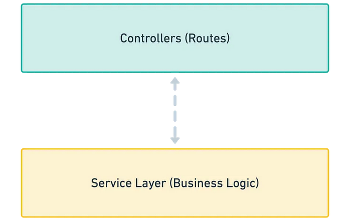

# Backend

Backend project for the Technical Assignment

## About the project

This is a RESTful API using a Model-Routes-Controllers-Services, in this case the entities acting as the Model of the project. Also being a mix of multiple design patterns: Functional programming and OOP programming, composite and singleton. being that the definition and structure of the routes-controllers and services are functional, but, the server definition and main error handling of it is a class.



### Controller Layer

`In charge of receive the request from the End-point, in this case the controller is divided in multiple middlewares before reaching the controller's logic, a file handler middleware and validation middleware`

### Service Layer

`The business logic, all the operation related to the files and transforming the data in useful information for the user.`

<br>

There is no Data Access Layer due to lack of connection to a database

## Technologies

This Project was made using the required technologies:

<p align="center">
  <a href="https://skillicons.dev">
    
  </a>
</p>

- [NodeJS](https://nodejs.org) Latest LTS version.
- [ExpressJS](https://expressjs.com/) To handle request to the server
- [Typescript](https://www.typescriptlang.org/) Strongly typed programming to validate types and better code development.
- [Joi](https://joi.dev/) Use as Middleware to validate data from requests

And many other libraries mainly use for request sanitization and improve code quality (linter/ formatter)

## Setup/Installation & Running

You will need to create a database and add the information in the `.env` file to be able to run the project

```bash
 # Installing Packages
 cd backend
 npm run install .
 npm run sync # Creates tables in the database
 npm run migrate:run # Creates rows in tables
 npm run  dev # Start project Local Host
```
